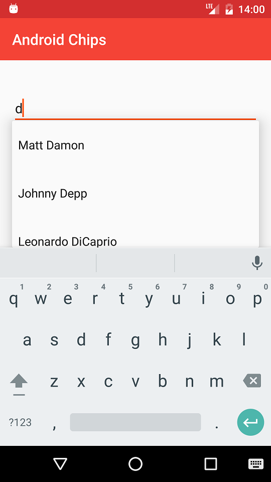
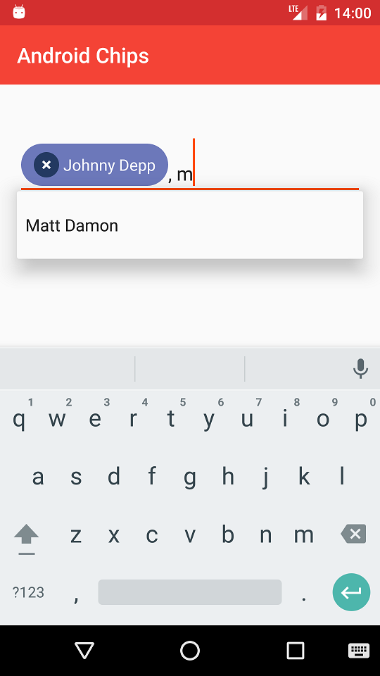
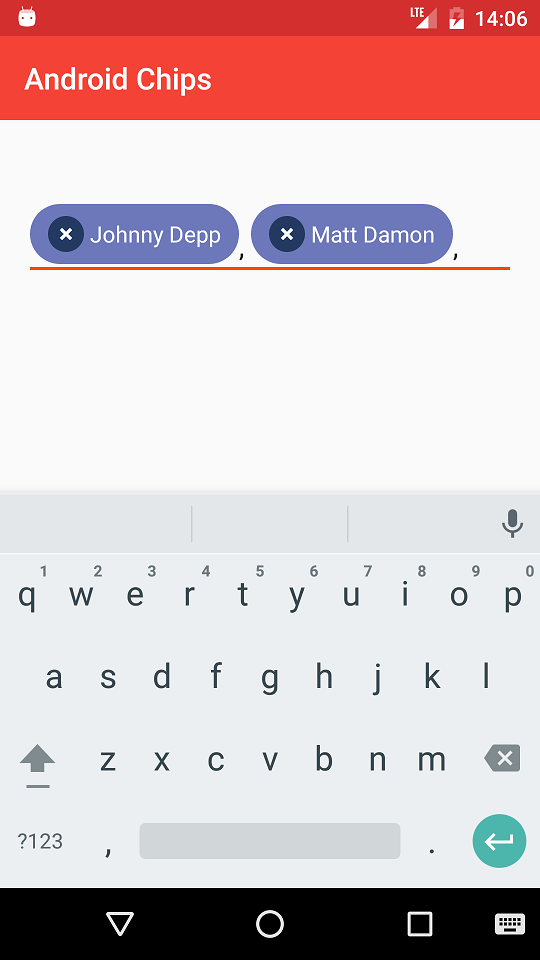

# Android Chips

Example of Android Chips in which you can select multiple Hollywood actors.

## Which controls are used

It uses a __MultiAutoCompleteTextView__ for the multi-selection and a custom __TextView__ (`ChipTextView`) for the `Chip` itself.

## Chip options

- Matt Damon
- Nicolas Cage
- Brad Pitt
- Johnny Depp
- George Clooney
- Bruce Willis
- Tom Cruise
- Will Smith
- Leonardo DiCaprio

## Screenshots

## License

    Copyright 2016 Esteban Latre

    Licensed under the Apache License, Version 2.0 (the "License");
    you may not use this file except in compliance with the License.
    You may obtain a copy of the License at

        http://www.apache.org/licenses/LICENSE-2.0

    Unless required by applicable law or agreed to in writing, software
    distributed under the License is distributed on an "AS IS" BASIS,
    WITHOUT WARRANTIES OR CONDITIONS OF ANY KIND, either express or implied.
    See the License for the specific language governing permissions and
    limitations under the License.
